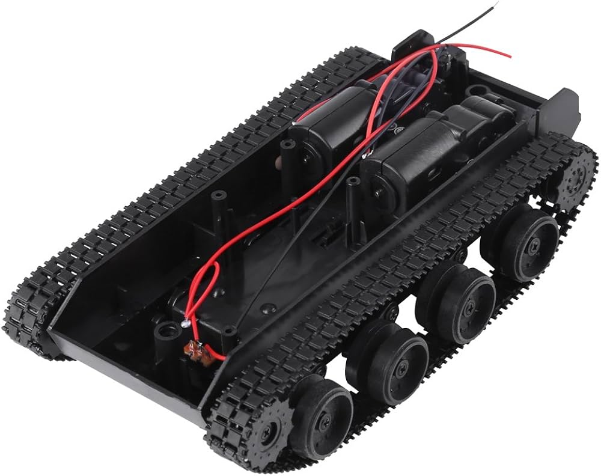
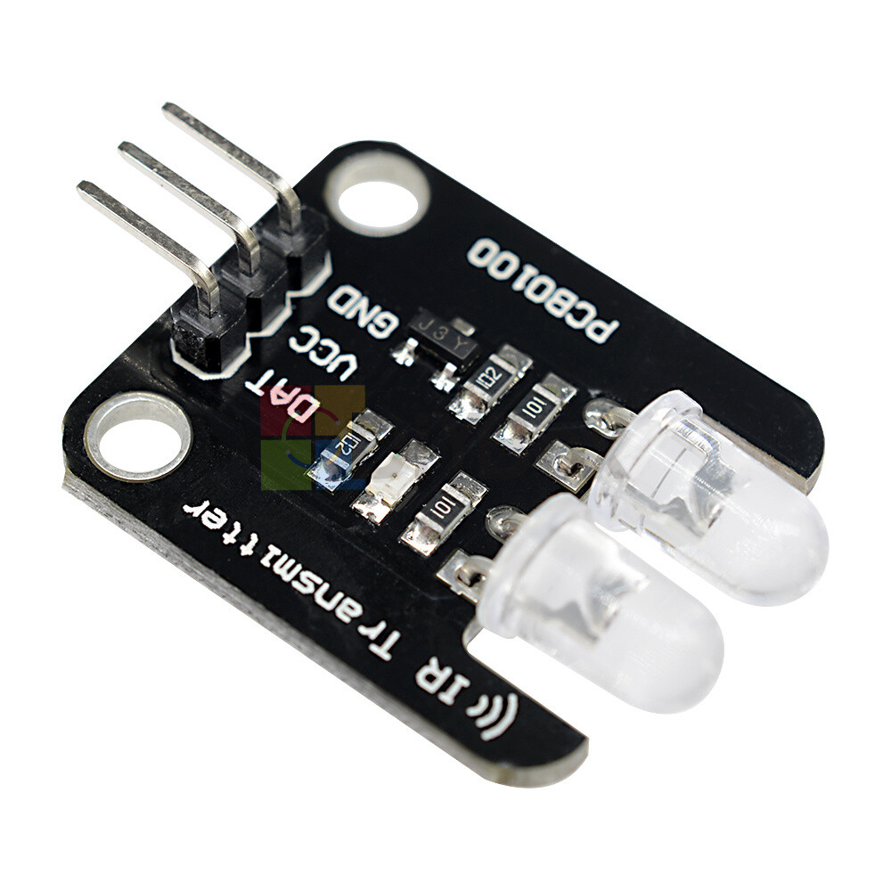
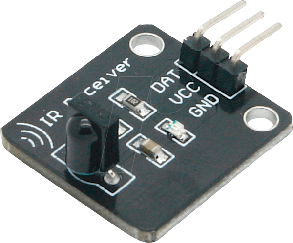
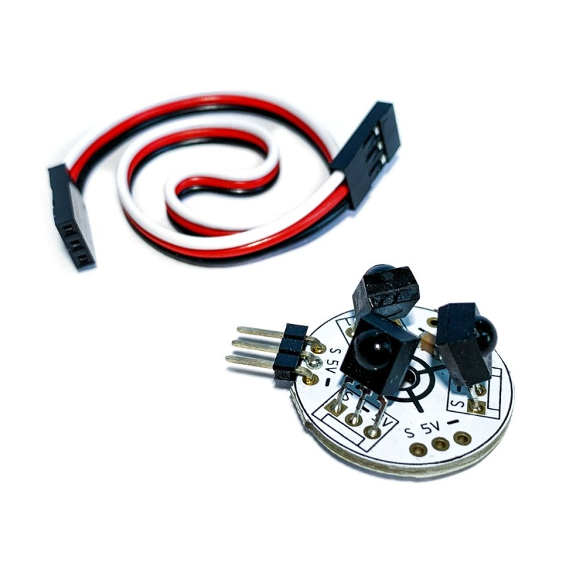
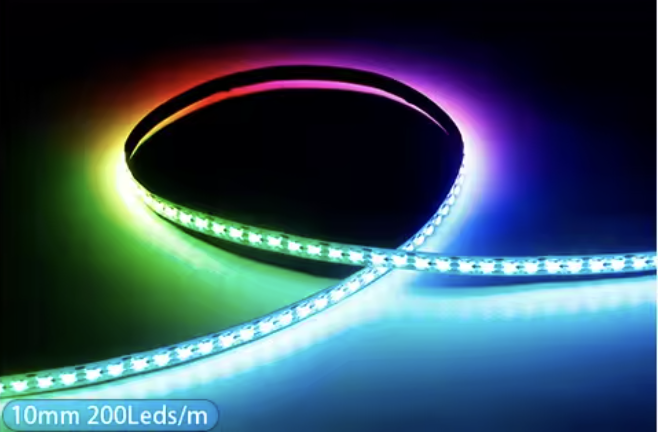
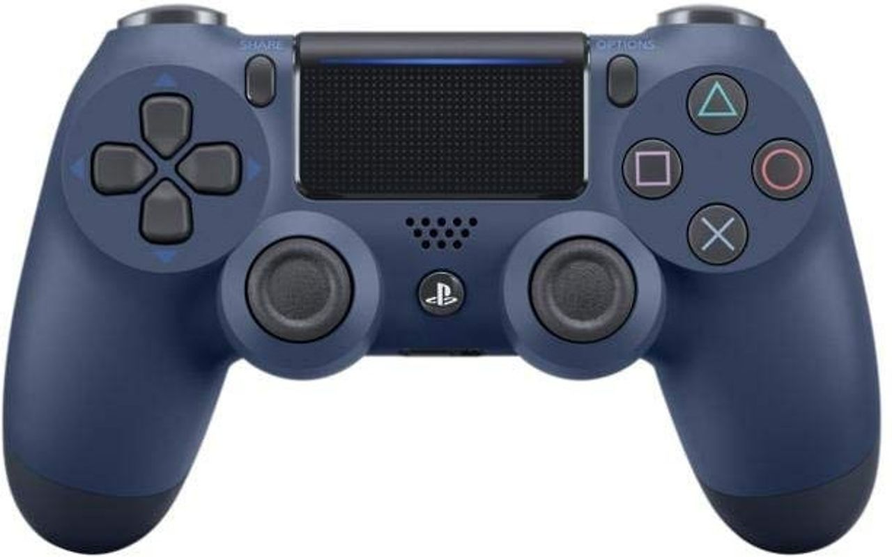
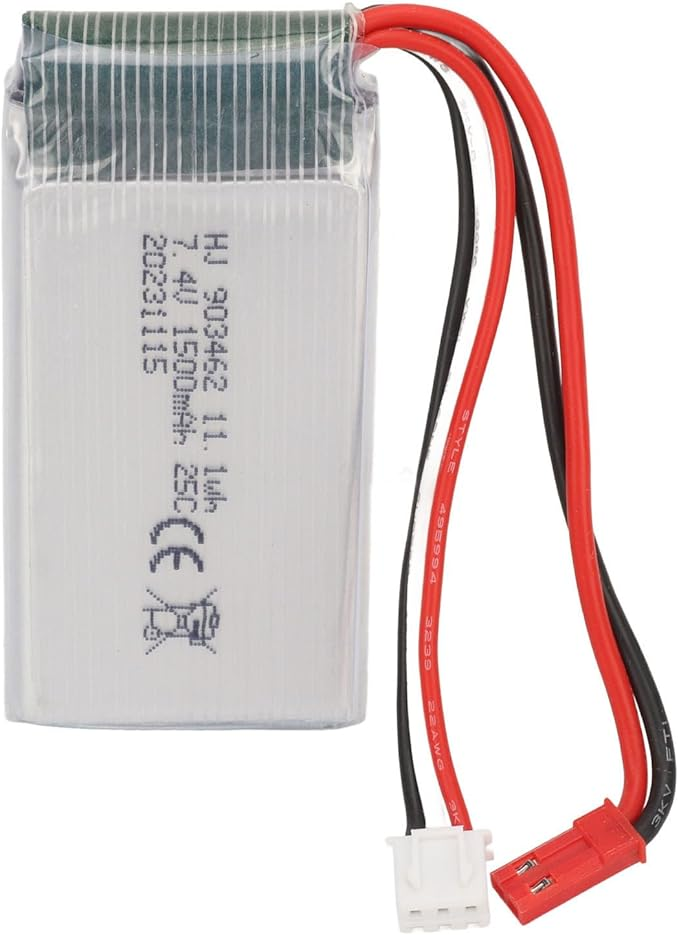

# ESP32 RC Combat Vehicle with Laser Tag
> PS4-controlled robotic battle platform

An ESP32-based remote-controlled combat vehicle combining motorized movement with laser tag functionality. The system is controlled via PS4 gamepad over Bluetooth and features infrared shooting capabilities, LED visual feedback, and motor chaos effects when hit.

## Demo Video

https://github.com/user-attachments/assets/5d45b09d-6281-4fc0-92ea-92ab8f06c85d

## Features

### Core Capabilities
* **PS4 Gamepad Control**: Wireless Bluetooth control with two joystick modes (one-stick and two-stick driving)
* **Motor Control**: Dual motor drive with expo curves, deadzone handling, and pivot turning
* **Laser Tag Combat**: Infrared transmitter/receiver for shooting and detecting hits
* **Visual Laser**: Physical laser pointer activated with triggers
* **Activity Lighting**: 67 RGB LEDs (WS2812/NeoPixel) for team colors, hit indicators, and game status
* **Hit Reactions**: Motor chaos mode activated when hit, disrupting vehicle control temporarily
* **Team System**: Multiple team color support with in-game color switching

### Control Modes
* **One-stick mode**: Single joystick controls both movement and turning
* **Two-stick mode**: Left stick for forward/backward, right stick for turning with pivot-in-place and high-speed turn boost

### Game Mechanics
* Hit detection with cooldown periods
* Fire rate limiting
* Team-based combat with color identification
* Game over state when hit too many times

## Hardware Components

Use an image search to find the best deal for every component.

| Component | Description | Image |
|---|---|---|
| **ESP32 Development Board** | Main microcontroller - handles all logic, Bluetooth communication, and I/O control |  |
| **Tank Chassis / Motors** | Tank/tracked vehicle chassis with dual DC motors for independent left/right control |  |
| **Motor Driver (L298N)** | H-bridge driver board module for controlling motor speed and direction |  |
| **IR LED (TSUS 5202)** | 950nm infrared transmitter for shooting opponents |  |
| **IR Receivers (TSOP31238)** | Two sensors (front & back) to detect incoming IR hits |    |
| **Laser Diode Module** | Visible laser pointer for aiming (GPIO 15) |  |
| **LED Strip (WS2812)** | 67 RGB addressable LEDs for team colors and status indicators (Search for: 5mm WS2812B 2020SMD RGBIC LED-strip Ultra-small WS2812 individual addressable DC5V) |  |
| **FPV Camera + TX** | Piggyback Micro AIO FPV-camera 5.8G 40CH OSD SmartAudio 25-400 mW 600TVL NTSC 120 F. Important: the FPV TX must support 25mW, everything higher won't work in a living room with multiple FPV TX's. So use 25mW only. |  |
| **PS4 DualShock Controller** | Wireless Bluetooth gamepad for vehicle and combat control |  |
| **2S LiPo Battery** | 7.4V 1200mAh - 1800mAh battery (1600 mAh gives you ~30 min runtime) |   |

### Pin Configuration
| Component | GPIO Pin |
|---|---|
| LED Strip Data | 13 |
| IR Transmit (Fire) | 2 |
| IR Receiver Front | 27 |
| IR Receiver Back | 26 |
| Laser | 15 |
| **Right Motor** | |
| Right Motor Enable | 22 |
| Right Motor Pin 1 | 16 |
| Right Motor Pin 2 | 17 |
| **Left Motor** | |
| Left Motor Enable | 23 |
| Left Motor Pin 1 | 18 |
| Left Motor Pin 2 | 19 |

## 3D Model Files

The `3d/` directory contains Fusion 360 (.f3d) design files and STL exports for mounting the ESP32 and components onto the tank chassis:

### Barrel
Barrel mount for the IR LED transmitter and laser module


**Files**: [Esp32TankBarrel.f3d](3d/Esp32TankBarrel.f3d) | [Esp32TankBarrel.stl](3d/Esp32TankBarrel.stl)

### Chassis Plate
Main mounting plate for ESP32, motor driver, and electronics


**Files**: [Esp32TankChassisPlate.f3d](3d/Esp32TankChassisPlate.f3d) | [Esp32TankChassisPlate.stl](3d/Esp32TankChassisPlate.stl)

### Chassis Plate Rails
Rail system for attaching components to the chassis plate


**Files**: [Esp32TankChassisPlateRails.f3d](3d/Esp32TankChassisPlateRails.f3d) | [Esp32TankChassisPlateRails.stl](3d/Esp32TankChassisPlateRails.stl)

### Turret
Turret assembly for mounting sensors and barrels with rotation capability


**Files**: [Esp32TankTurret.f3d](3d/Esp32TankTurret.f3d) | [Esp32TankTurret.stl](3d/Esp32TankTurret.stl)

The .f3d files can be opened and modified in Autodesk Fusion 360. The .stl files are ready for 3D printing.

## Development

### VS Code with PlatformIO (Recommended)
This project is set up for VS Code with the PlatformIO extension.

**Setup:**
1. Install [VS Code](https://code.visualstudio.com/)
2. Install the PlatformIO IDE extension from the VS Code marketplace
3. Open this project folder in VS Code
4. PlatformIO will automatically detect `platformio.ini` and install dependencies

**Building and uploading:**
- Click the PlatformIO toolbar icon (checkmark) to build
- Click the upload icon (arrow) to flash to ESP32
- Or use the command palette: `PlatformIO: Upload`

### PlatformIO CLI
If you prefer the command line:

**Building and uploading:**
```bash
platformio run --target upload
```

**Monitoring serial output:**
```bash
platformio device monitor
```

### Dependencies
The project uses the following libraries (auto-installed by PlatformIO):
* NeoPixelBus - Advanced LED control
* PS4_Controller_Host - PS4 gamepad support

### PS4 Controller Setup
1. Find your ESP32's MAC address (use included `showMacAddress.cpp` utility)
2. Pair your PS4 controller using a PC/smartphone app (search for (SixAxisPairTool)[https://docs.totemmaker.net/assets/files/sixaxis/SixaxisPairToolSetup-0.3.1.exe] must have sha256 hash: b274dfc581adbf50787b6498c2e6878447e2ebe0be78c296795295b91991c2f6)
3. Set the controller's master address to your ESP32's MAC address
4. Power on the controller - it should connect automatically

## PS4 Gamepad Controls

### Movement
* **Right Stick** (one-stick mode): Forward/backward/left/right - combined movement
* **Left Stick** (two-stick mode): Forward/backward movement
* **Right Stick** (two-stick mode): Turning and pivot-in-place

### Combat
* **R1 / RB**: Fire infrared shot + activate laser
* **L1 / LB**: Activate laser without firing

### Team Selection
* **Square / X**: Pink team
* **Cross / A**: Blue team  
* **Circle / B**: Orange team
* **Triangle / Y**: Green team

### Settings
* **D-Pad Up**: Toggle joystick mode (one-stick ↔ two-stick)
* **Share**: Reset preferences to defaults
* **L2 + R2** (held together): In-game preferences reset

## Architecture

### Software Components
* **main_control**: Core game logic and FreeRTOS task management
* **PS4_gamepad**: PS4 controller interface abstraction
* **motor_control**: Dual motor mixing with expo curves and driving modes
* **motors**: Low-level motor driver interface
* **ir_fire / ir_sensors**: Infrared transmission and reception using ESP32 RMT peripheral
* **laser**: Laser pointer control
* **activity_lights**: LED patterns for game state feedback
* **flasher**: LED flashing effects
* **colors**: Team color definitions
* **prefs**: Persistent preferences storage (EEPROM)

The firmware uses FreeRTOS tasks for concurrent handling of:
* IR message reception
* LED animations
* Motor control
* Gamepad input processing

## Technical Details

### Infrared Protocol
Uses ESP32's RMT (Remote Control) peripheral for precise IR timing. Protocol details in `src/IR32/` library. The system transmits team-specific codes to differentiate between friendly and enemy fire.

### Motor Chaos Mode
When hit, the `MotorChaosMonkey` class temporarily interferes with motor control, creating erratic movement to simulate being "stunned" in combat.

### Preferences Storage
Game settings and team colors are persisted to EEPROM and loaded on boot.

## Debugging
Serial debugging at 115200 baud. Build flags in [platformio.ini](platformio.ini) enable ESP_LOG output:
```
-DCORE_DEBUG_LEVEL=4
-D LOG_LOCAL_LEVEL=ESP_LOG_DEBUG
```

## License
GPL-3.0 - See [LICENSE](LICENSE)
